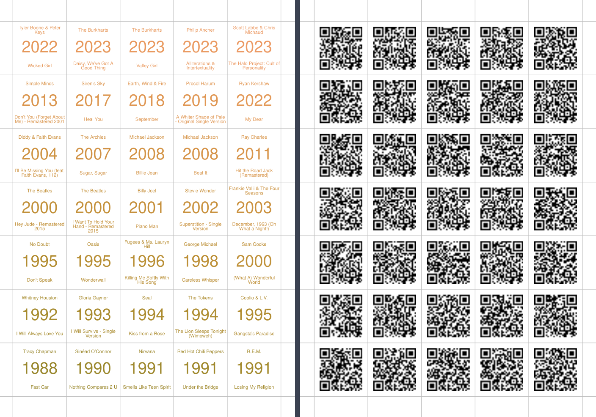

# hitsteR

[R](https://www.r-project.org/) functions to make a song guessing game. Based on a Spotify playlist, they generate a pdf with artist, year, and song title on one side and a QR code to play the song on the other side.

## How to play

The rules of game can be found [here](https://hitstergame.com/en-us/how-to-play/).

## License

HitsteR is licensed under the [GNU General Public License][https://www.gnu.org/licenses/gpl-3.0.html], version 3.
