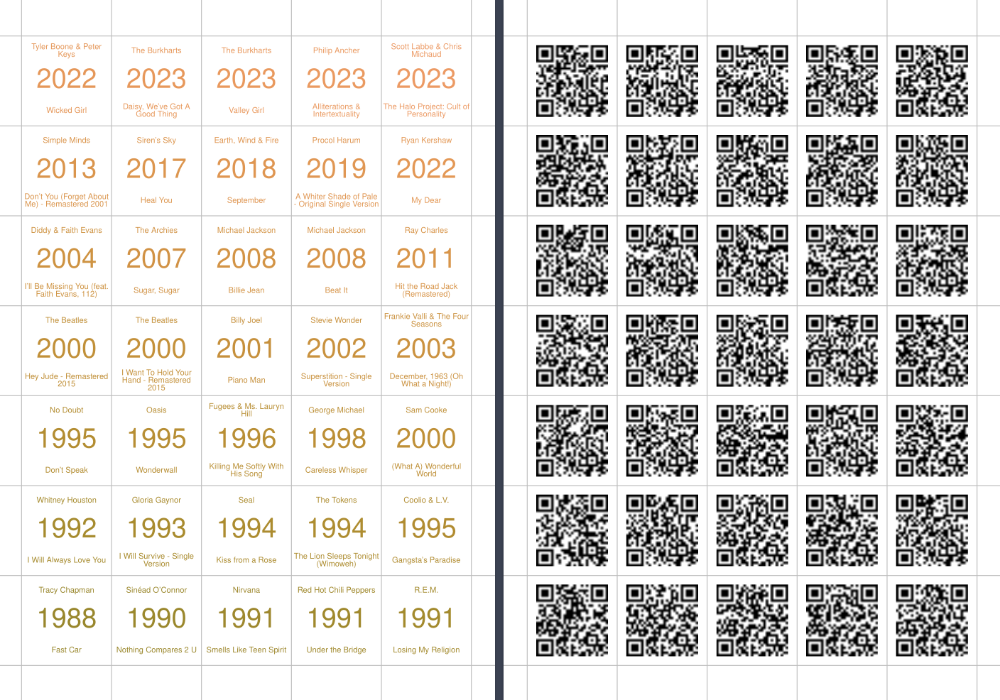

```{r, include = FALSE}
knitr::opts_chunk$set(
  collapse = TRUE,
  comment = "#>"
)
# set environment variables
# source("../.Renviron")
```

# Setup

```{r setup}
library(hitsteR)
```

Before beginning, create a Spotify playlist or select a public one that you want to turn into a game. The years of the songs should be approximately uniformly distributed over several decades. 

Assign your [Spotify client ID and client secret](https://developer.spotify.com/my-applications/#!/applications) to the `SPOTIFY_CLIENT_ID` and `SPOTIFY_CLIENT_SECRET` environment variables.


```{r, eval=FALSE}
set_spotify_credentials(my_spotify_client_id, my_spotify_client_secret)
```

# Get and clean tracks from Spotify API

```{r get-tracks}
my_tracks_raw <- get_tracks(playlist_id = "6i2Qd6OpeRBAzxfscNXeWp")
```

# Clean track info

```{r clean-tracks}
my_tracks <- clean_tracks(my_tracks_raw)
```

# Make single card layout

```{r make-cards, eval = FALSE}
make_cards(tracks = my_tracks, color = TRUE)
#
```


# Prepare cards

- Print the pdf double-sided and mirrored on the long edge. For best results use heavy paper or laminate the pages.
- Cut pages along the marks.
- Enjoy!
